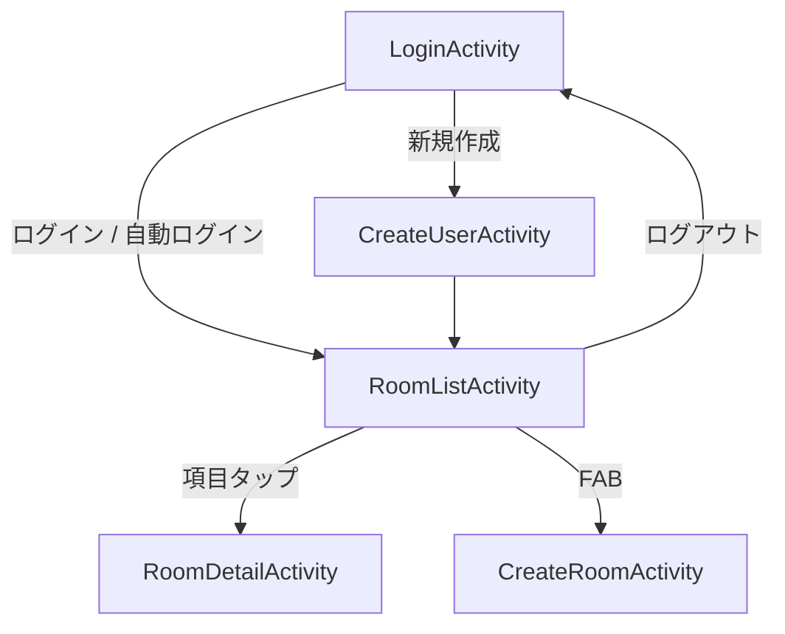

# RoomMonitor（Room Monitor App）

学校の**教室**を号館ごとに登録・一覧・詳細表示し、各教室に設置したセンサーの**気温・湿度をグラフで可視化**することを目的とした、学生向け Android アプリです。学籍番号でログインし、担当する教室の環境を確認したり、しきい値を超えた際に通知を受け取ったりする使い方を想定しています。

> ⚠️ **開発ステータス：UI スケルトン段階**
> 現在実装されているのは画面遷移・入力バリデーション・カメラ撮影/リサイズのみです。
> ユーザー認証、WebAPI 連携、教室データの永続化、BLE センサー連携、**気温・湿度グラフ表示**、通知はすべて未実装（TODO スタブ）です。

---

## 主な機能

### 実装済み

| 機能 | 補足 |
| --- | --- |
| ログイン画面 | 学籍番号（数値）＋パスワードの**入力チェックのみ**。実際の認証は未実装 |
| ユーザー新規作成画面 | 入力チェック＋パスワード一致確認のみ。登録処理は未実装 |
| 自動ログイン | `SharedPreferences`（ファイル名 `RoomMonitor` / キー `userId`）の有無で判定 |
| 教室一覧 | `RecyclerView` + `GridLayoutManager`（2列グリッド）+ `CardView`。現状は**ダミーデータ3件**を表示 |
| 号館での絞り込み UI | スピナー＋検索ボタンを配置。**検索処理は空実装** |
| 教室登録画面 | 教室名・号館・備考・写真の入力フォーム |
| カメラ撮影 | `ActivityResultContracts.TakePicture` ＋ `FileProvider`。EXIF 回転補正・正方形センタークロップ・512×512 リサイズを実装 |
| 教室詳細画面 | 教室名・号館・備考・画像・グラフ領域のプレースホルダ表示 |
| ログアウト | オプションメニューから `userId` を削除しログイン画面へ戻る |

### 未実装（ロードマップ / TODO）

- 実際のユーザー認証・登録の WebAPI 連携
- FCM トークン取得とプッシュ通知登録
- 教室情報の永続化・一覧取得 API（`RoomItem` は直近コミットで DB 連携しやすい命名に変更済み）
- 教室写真のアップロード・保存
- BLE センサー（気温・湿度）との接続（詳細画面の Bluetooth FAB）
- **気温・湿度の時系列グラフ表示**（詳細画面の `roomChartView` は空の `View` プレースホルダ）
- 通知設定（詳細画面の通知 FAB）
- 号館での検索処理

---

## 画面構成

| 画面 | Activity | 役割 | 主な遷移先 |
| --- | --- | --- | --- |
| ログイン | `LoginActivity`（LAUNCHER / `exported="true"`） | 学籍番号ログイン。自動ログイン判定 | 教室一覧 / ユーザー作成 |
| ユーザー作成 | `CreateUserActivity` | アカウント新規作成 | 教室一覧 |
| 教室一覧 | `RoomListActivity` | 教室のグリッド表示・号館絞り込み | 教室詳細 / 教室登録 |
| 教室登録 | `CreateRoomActivity` | 教室情報の入力・写真撮影 | （登録後 未実装） |
| 教室詳細 | `RoomDetailActivity` | 教室情報とセンサーデータの表示。BLE / 通知 FAB はスタブ | — |



---

## 技術スタック

| 分類 | 内容 |
| --- | --- |
| 言語 | Kotlin ※後述の注意点あり |
| ビルド | Android Gradle Plugin 9.1.1 / Gradle 9.3.1（wrapper, `-bin`）/ Foojay Resolver Convention 1.0.0 |
| SDK | `compileSdk` 37 / `minSdk` 27（Android 8.1）/ `targetSdk` 36 |
| JDK | ソース・ターゲット Java 11、Gradle デーモン toolchain 21 |
| UI | Android View システム（**Jetpack Compose 不使用**）、Material 3（`Theme.Material3.DayNight`）、`ConstraintLayout`、`CardView`、`RecyclerView`、`FloatingActionButton` |
| 永続化 | `SharedPreferences` のみ（キー `userId`）。**Room は未使用**（プロジェクト名の "Room" は永続化ライブラリではなく物理的な「教室」の意） |
| ネットワーク | 未導入（Retrofit / OkHttp なし、`INTERNET` パーミッションなし） |

### 依存ライブラリ（`gradle/libs.versions.toml`）

| ライブラリ | バージョン |
| --- | --- |
| androidx.core:core-ktx | 1.19.0 |
| androidx.appcompat:appcompat | 1.8.0 |
| com.google.android.material:material | 1.14.0 |
| androidx.activity:activity | 1.13.0 |
| androidx.constraintlayout:constraintlayout | 2.2.2 |
| androidx.cardview:cardview | 1.0.0 |
| androidx.recyclerview:recyclerview | 1.4.0 |
| junit:junit（test） | 4.13.2 |
| androidx.test.ext:junit（androidTest） | 1.3.0 |
| androidx.test.espresso:espresso-core（androidTest） | 3.7.0 |

### ⚠️ ビルド上の注意点

- **Kotlin Gradle プラグインが未適用です。** ルート／`app` の `build.gradle.kts` にも `libs.versions.toml` にも `org.jetbrains.kotlin.android` が定義されていません。ソースはすべて Kotlin のため、環境によってはビルドが通りません。その場合は version catalog にプラグインを追加し、`app/build.gradle.kts` の `plugins {}` で適用してください。
- ビルドツールが先行版です（AGP 9.1.1 / Gradle 9.3.1 / `compileSdk` 37）。対応する Android Studio（Canary/Preview 系）と JDK 21、Android SDK Platform 37 が必要です。

---

## グラフ描画ライブラリについて（未選定）

教室詳細画面（`activity_room_detail.xml`）には「部屋のセンサーデータ」ラベルと空の `View`（`roomChartView`）があるだけで、チャートライブラリはまだ導入されていません。候補：

| ライブラリ | 特徴 |
| --- | --- |
| **MPAndroidChart** | View ベース。実績が豊富で、時系列の折れ線グラフに定番 |
| **Vico** | View / Compose の両対応。比較的新しくメンテナンスが活発 |

現行の View 構成を維持するなら MPAndroidChart / Vico のどちらでも、将来 Compose へ移行するなら Vico が候補になります。**選定は未決定です。**

---

## データモデル

`app/src/main/java/ecccomp/iot/roommonitor/model/RoomItem.kt`

```kotlin
data class RoomItem(
    val id: Int,
    val name: String,
    val building: String,
    val remarks: String?,
    val image_uri: String?,
    val user_id: Int,
)
```

| フィールド | 意味 |
| --- | --- |
| `id` | 教室 ID |
| `name` | 教室名（例：`3701教室`） |
| `building` | 号館（例：`3号館`） |
| `remarks` | 備考（任意） |
| `image_uri` | 教室写真の URI 文字列（任意） |
| `user_id` | 登録ユーザー ID |

直近コミット `33b4935`「教室情報の項目を DB と連携しやすい名称に変更」で、`imageUri` → `image_uri`、`userId: String` → `user_id: Int` に変更し、`id: Int` を追加しています。**気温・湿度を表すエンティティはまだ存在しません。**

---

## セットアップ / ビルド

### 必要環境

- Android Studio（AGP 9.x 対応版 / Preview 系）
- JDK 21
- Android SDK Platform 37
- `local.properties`（git 管理外）に `sdk.dir` を設定

### コマンド

```bash
./gradlew assembleDebug          # Debug APK をビルド
./gradlew installDebug           # 接続中のデバイス / エミュレータにインストール
./gradlew test                   # ユニットテスト（現状はテンプレートのみ）
./gradlew connectedAndroidCheck  # 計装テスト（現状はテンプレートのみ）
```

Android Studio で開いて Run しても構いません（実機 / エミュレータは API 27 以上）。

---

## プロジェクト構成

```
RoomMonitor/
├── app/
│   ├── build.gradle.kts               # モジュール設定・依存関係
│   └── src/
│       ├── main/
│       │   ├── AndroidManifest.xml    # Activity 構成・FileProvider（パーミッション宣言なし）
│       │   ├── java/ecccomp/iot/roommonitor/
│       │   │   ├── LoginActivity.kt         # ログイン / 自動ログイン
│       │   │   ├── CreateUserActivity.kt    # ユーザー新規作成
│       │   │   ├── RoomListActivity.kt      # 教室一覧（2列グリッド・ダミーデータ）
│       │   │   ├── CreateRoomActivity.kt    # 教室登録・カメラ撮影・画像リサイズ
│       │   │   ├── RoomDetailActivity.kt    # 教室詳細・センサー / 通知 FAB（スタブ）
│       │   │   ├── adapter/RoomAdapter.kt   # 教室一覧の RecyclerView アダプタ
│       │   │   └── model/RoomItem.kt        # 教室データモデル
│       │   └── res/
│       │       ├── layout/            # activity_login / create_user / room_list /
│       │       │                      # create_room / room_detail / room_item の6つ
│       │       ├── menu/action_menu.xml     # ログアウトメニュー
│       │       ├── values/ , values-night/  # colors / themes / strings（Material 3 配色）
│       │       └── xml/               # backup_rules / data_extraction_rules / filepaths
│       ├── test/ .../ExampleUnitTest.kt
│       └── androidTest/ .../ExampleInstrumentedTest.kt
├── gradle/
│   ├── libs.versions.toml             # バージョンカタログ
│   └── wrapper/                       # Gradle wrapper（9.3.1）
├── build.gradle.kts                   # ルートビルドスクリプト
└── settings.gradle.kts               # モジュール定義・リポジトリ設定
```

---

## テスト

自動生成された `ExampleUnitTest`（`2 + 2 = 4`）と `ExampleInstrumentedTest`（パッケージ名の確認）の2ファイルのみで、プロジェクト固有のテストは未整備です。

---

## 開発ロードマップ

- [ ] ユーザー認証・登録の WebAPI 連携（ログイン / サインアップ）
- [ ] FCM トークン取得とプッシュ通知登録
- [ ] 教室 CRUD の永続化・一覧取得 API（号館での検索処理を含む）
- [ ] 教室写真のアップロード・保存
- [ ] BLE センサー（気温・湿度）との接続
- [ ] **気温・湿度の時系列グラフ表示**（チャートライブラリの選定・導入）
- [ ] しきい値超過時の通知設定
- [ ] ユニット / UI テストの整備
- [ ] Kotlin Gradle プラグインの適用など、ビルド設定の整理

---

## 補足

- パッケージ名 / `applicationId`：`ecccomp.iot.roommonitor`
- バージョン：`versionName` 1.0（`versionCode` 1）
- ライセンス：未定（`LICENSE` ファイルなし）
